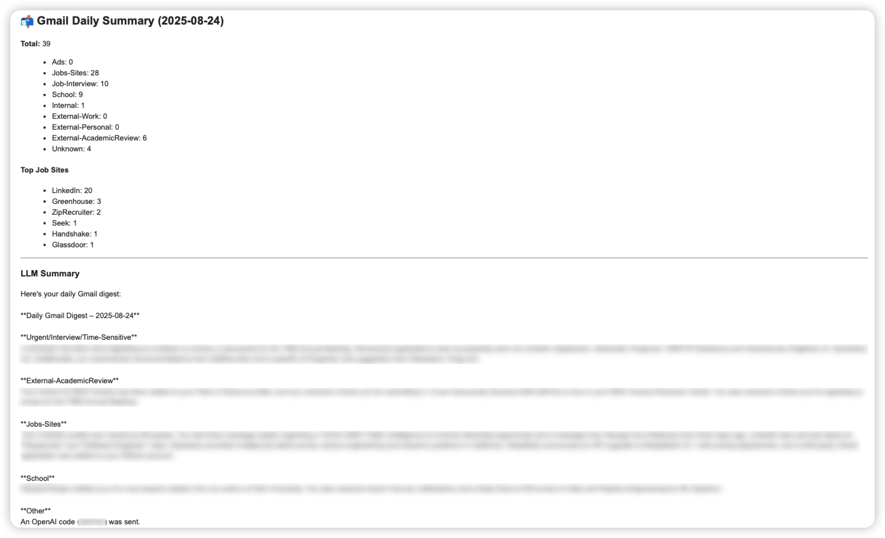
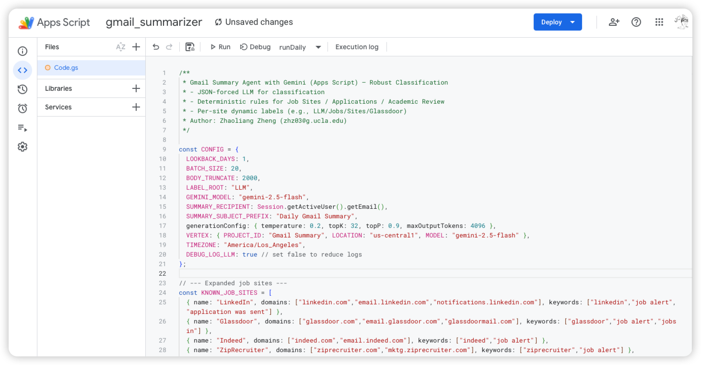
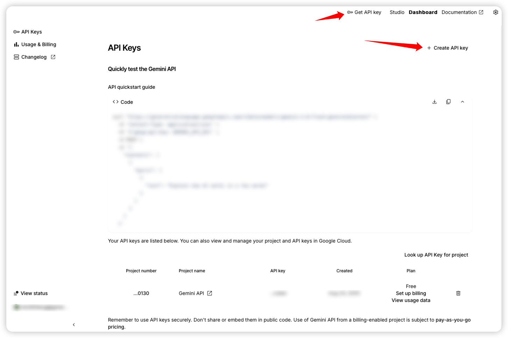
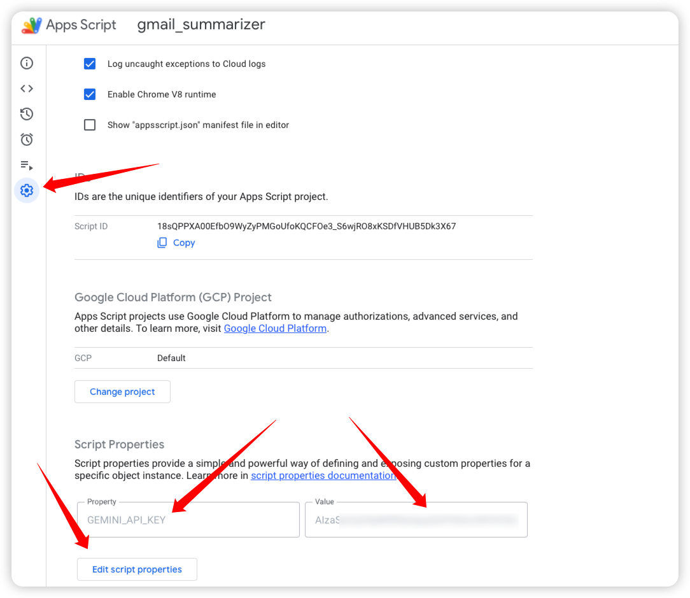

# Automated Gmail Classification and Summarization with Gemini AI

## Overview

Drowning in dozens, hundreds, or even thousands of emails every day?
I built this project to solve my own struggle with **email overload**.

Like many people, I use Gmail not only for personal communication, but also for:

- 🔔 **Job applications & recruiter notifications**
- 🎓 **Academic review requests & conference submissions**
- 📢 **Ads, newsletters, and notifications**
- 🏫 **School or course updates**
- 💼 **Work-related and internal messages**

The problem: Gmail’s default filters and labels weren’t enough. I wanted a smarter system that could **automatically classify emails, apply labels, and generate a daily digest** — so I could see what really matters without digging through the inbox.

That’s why I built **LLM Gmail Summarizer**:

- Combines **deterministic rules** (for job sites, academic reviews, internal vs external emails, etc.) with **Gemini AI classification** for robustness.
- Sends a **concise daily summary** of your inbox (grouped by category, highlighting urgent or actionable items).
- Automatically applies **labels** in Gmail for better long-term organization.

In short: This project helps turn **email chaos** into **actionable clarity**.

**Here is what it looks like:**

## Introduction

This project leverages Google Apps Script and the Gemini AI to automatically scan your Gmail inbox daily, intelligently classify emails, apply labels, and generate a summary report sent directly to you.

**Core Features:**
- **Intelligent Classification**: Combines precise heuristic rules (e.g., identifying emails from specific job sites) with the powerful language understanding of the Gemini model to categorize emails into types like Jobs, Ads, Academic, Work, Personal, and more.
- **Dynamic Labeling**: Automatically creates and applies hierarchical labels in Gmail (e.g., `LLM/Jobs/Sites/LinkedIn`), keeping your inbox organized.
- **Daily Summaries**: Generates a daily, easy-to-read summary email that reports statistics from the previous day's emails and provides an AI-generated digest of key information, helping you quickly grasp what's important.
- **Highly Customizable**: You can easily tweak the script's behavior by modifying the `CONFIG` object, allowing you to adjust the lookback period, batch processing size, AI model selection, and more.

---

## Step-by-Step Deployment Guide

Follow these steps to deploy and configure the script.

### Step 1: Create a Google Apps Script Project

1.  Navigate to [script.google.com](https://script.google.com).
2.  Click **"New project"** in the top-left corner.
3.  Give the project a name, such as "Gmail LLM Summarizer".

Here is an example: 

### Step 2: Paste the Code

1.  Delete the default `function myFunction() { ... }` content in the code editor.
2.  Copy the entire content of the `code.gs` file from this project and paste it into the editor.
3.  Click the save icon (💾) at the top.

### Step 3: Obtain and Set the Gemini API Key

The script requires a Gemini API key to make calls to the AI model.

1.  Visit [Google AI for Developers](https://ai.google.dev/).
2.  Click **"Get API key in Google AI Studio"**.
3.  If you don't have one already, click **"Create API key"** to generate a new key.
4.  **Copy** the generated API key.
5.  Return to your Apps Script project and click on **"Project Settings"** (the gear icon ⚙️) in the left-hand menu.
6.  In the page that opens, find the **"Script Properties"** section and click **"Add script property"**.
7.  In the **"Property"** field, enter `GEMINI_API_KEY`.
8.  In the **"Value"** field, paste the API key you just copied.
9.  Click **"Save script properties"**.

**IMPORTANT**: Do not paste your API key directly into the code. Setting it as a script property keeps it secure.

Here is example: 

### Step 4: Configure Gmail Labels and Parameters

The script creates labels automatically, but you might want to customize the root label.

1.  At the top of the `code.gs` file, locate the `CONFIG` object.
2.  You can modify the line `LABEL_ROOT: "LLM"`. The value `"LLM"` is the parent for all automatically created labels (e.g., `LLM/Jobs/Sites`). You can change this to any name you prefer, such as `"Auto"` or `"AI"`.

### Step 5: First Run & Authorization

Before setting up the automated trigger, you must run the script manually once to grant the necessary permissions.

1.  In the Apps Script editor's function selection dropdown menu at the top, select `runDaily`.
2.  Click the **"Run"** button next to it.
3.  A **"Authorization required"** window will pop up. Click **"Review permissions"**.
4.  Choose your Google account.
5.  You will likely see a "Google hasn’t verified this app" warning. This is normal because the script was created by you. Click **"Advanced"**, then click **"Go to [Your Project Name] (unsafe)"**.
6.  In the next window, grant the script permission to access your Gmail data and connect to external services (for the Gemini API). Click **"Allow"**.
7.  The script will now run once. You can view its output in the "Execution log" at the bottom.

### Step 6: Set Up the Daily Trigger

To make the script run automatically every day, you need to create a trigger. The script includes a handy function to do this for you.

1.  In the function selection dropdown menu, select `installDailyTrigger`.
2.  Click the **"Run"** button.
3.  This function will automatically create a trigger that runs the `runDaily` function every day around 8:30 AM (Los Angeles time).
4.  You can view, edit, or delete this trigger by clicking on **"Triggers"** (the clock icon ⏰) in the left-hand menu. You can adjust the time and frequency as needed.

**Congratulations!** You have successfully deployed the automated email classifier and summarizer. It will now organize and summarize your emails for you every day.

---

## Code Deep Dive

### Workflow

The script's core workflow (in the `runDaily` function) is as follows:
1.  **Fetch Threads**: Uses `GmailApp.search` to get all email threads within the specified lookback period.
2.  **Flatten Messages**: Breaks down email threads into individual messages and extracts key information like sender, subject, and a plain-text snippet.
3.  **Apply Heuristics**: Applies a set of deterministic rules to each email. For example, it identifies known job sites (like LinkedIn, Indeed) or academic review requests based on sender domains and keywords. This provides a strong initial classification hint for the AI.
4.  **Batch Classify with AI**: Sends the pre-processed email information in batches to the Gemini AI. A carefully crafted prompt forces the AI to return classification results in a structured JSON format. If the AI call fails, the script falls back to using only the heuristic-based results.
5.  **Apply Labels**: Translates the classification results (from both AI and heuristics) into Gmail labels and applies them to the corresponding email threads using `GmailApp.createLabel` and `thread.addLabel`.
6.  **Generate & Send Summary**: Calls the Gemini AI again to transform all the classified information into a concise summary report. This HTML-formatted report is then sent to you via `MailApp.sendEmail`.

### Parameter Configuration (`CONFIG` object)

You can customize the script's behavior by adjusting the values in the `CONFIG` object at the top of the `code.gs` file.

| Parameter | Type | Description | Default Value | Impact on Results |
| :--- | :--- | :--- | :--- | :--- |
| `LOOKBACK_DAYS` | Number | How many days back the script should scan for emails on each run. | `1` | A value of `1` means it processes yesterday's emails. Increasing it will process older mail but increase runtime and API costs. |
| `BATCH_SIZE` | Number | How many emails to send to the Gemini API for classification in a single request. | `20` | A smaller value is more stable but requires more API calls. A larger value is more efficient but risks hitting API request size limits. |
| `BODY_TRUNCATE` | Number | The number of characters from the start of the email body to use for analysis. | `2000` | Long enough to capture key info while avoiding excessively long API payloads. Can be increased if summaries are inaccurate. |
| `LABEL_ROOT` | String | The root path for all automatically created Gmail labels. | `"LLM"` | Changing this alters the top-level directory for labels, e.g., `"AI/Jobs/Sites"`. |
| `GEMINI_MODEL` | String | The Gemini model to use for classification and summarization. | `"gemini-1.5-flash"` | Can be swapped for other compatible models like `"gemini-pro"`. Models differ in speed, cost, and quality. |
| `SUMMARY_RECIPIENT` | String | The email address that receives the daily summary report. | `Session.getActiveUser().getEmail()` | Defaults to the user running the script. |
| `SUMMARY_SUBJECT_PREFIX` | String | The subject line prefix for the daily summary email. | `"Daily Gmail Summary"` | Helps you identify or filter for summary emails in your inbox. |
| `generationConfig` | Object | Generation parameters for the Gemini API. | `{...}` | Controls the creativity and randomness of the AI's output. `temperature: 0.2` produces more deterministic results, suitable for classification. |
| `TIMEZONE` | String | The timezone used for date-based queries and triggers. | `"America/Los_Angeles"` | Affects the start time of the `newer_than:Xd` query and the daily trigger time. Change this to your local timezone. |
| `DEBUG_LOG_LLM` | Boolean | Whether to print detailed LLM call information to the execution log. | `true` | Useful for debugging but creates verbose logs. Recommended to set to `false` once the script is running stably. |

### Key Functions

- **`runDaily()`**: The main entry point that orchestrates the entire email processing and summarization workflow.
- **`installDailyTrigger()`**: A convenience function to set up the daily automated trigger.
- **`fetchRecentThreads_()`**: Fetches recent emails from Gmail.
- **`addHeuristics_()`**: Adds deterministic classification hints based on rules, supplementing the AI.
- **`classifyEmailsInBatches_()`**: The core AI classification function that builds prompts, calls the API, and parses results.
- **`applyLabels_()`**: Converts classification results into Gmail labels and applies them to threads.
- **`buildDailySummary_()`**: Constructs the final HTML summary email sent to the user.
- **`fetchGeminiJSON_()` / `fetchGeminiTEXT_()`**: Two separate functions for calling the Gemini API to get either a JSON or a plain text response.

---

## License

This project is licensed under the terms of the [LICENSE](./LICENSE) file.